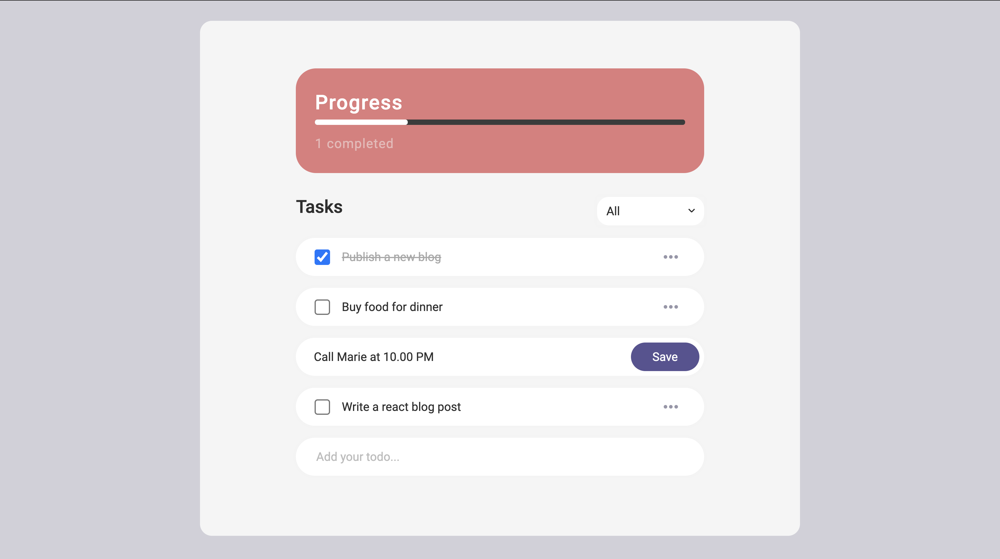

<h1>Introduction</h1>

## [https://todoclient.vercel.app/](https://todoclient.vercel.app/)

<br />

A simple To-do client app, written in React. Utilizing React Hooks <i>(useReducer, createContext, useContext, useState, useEffect)</i>, JSON API, advanced/responsive styling using SASS/grid.</p>

All the data is pulled from a mock JSON API hosted on Heroku. <br/>
For details on that, check here: [(JSON API) https://github.com/shal0mdave/todo-api](https://github.com/shal0mdave/todo-api)
<br />
<br />

<br />


# Getting Started

## Install dependencies:

```bash
npm i
# or
yarn
```
<br />
<br />


## Run the development server:

```bash
npm run dev
# or
yarn dev
```

<br />
<br />

## Learn More 

You can learn more in the [Create React App documentation](https://facebook.github.io/create-react-app/docs/getting-started).

To learn React, check out the [React documentation](https://reactjs.org/).
